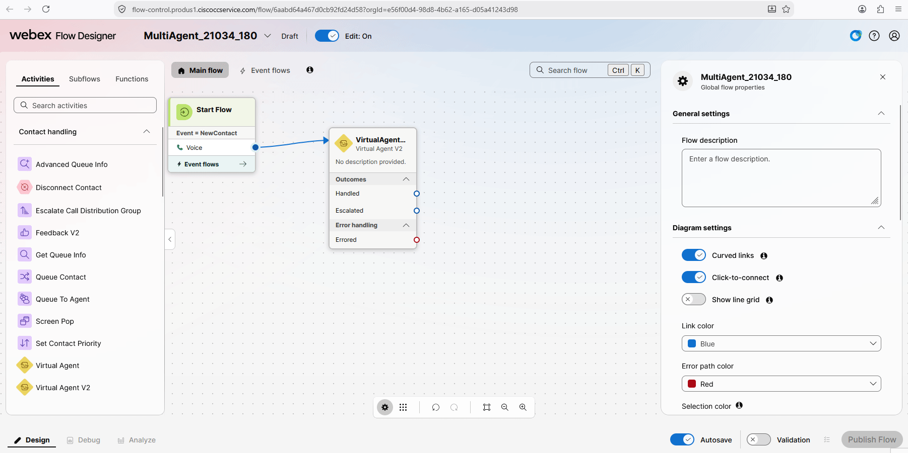
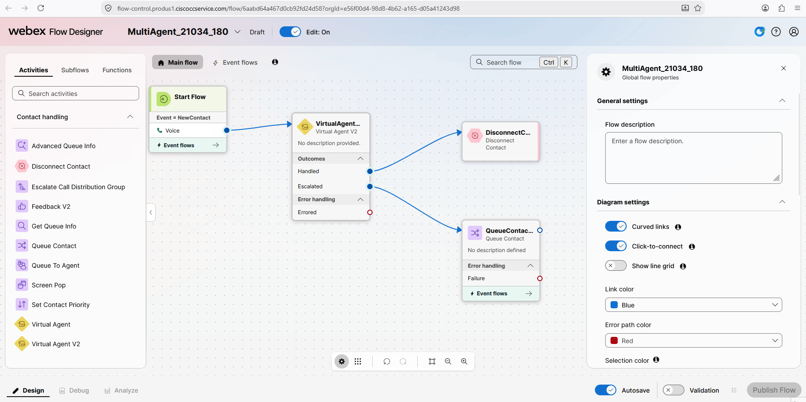
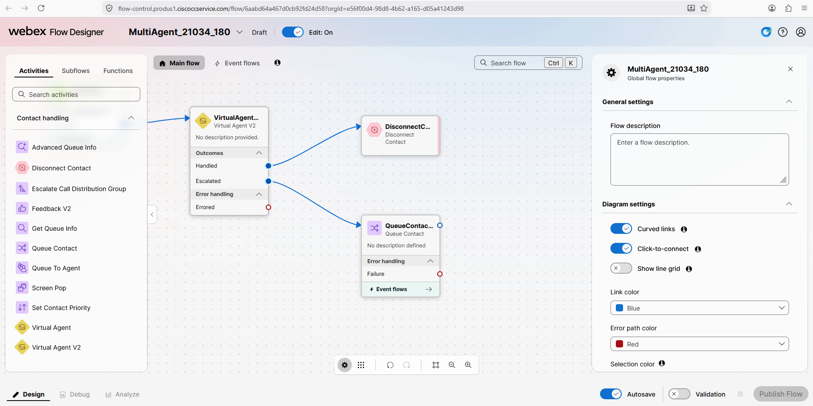
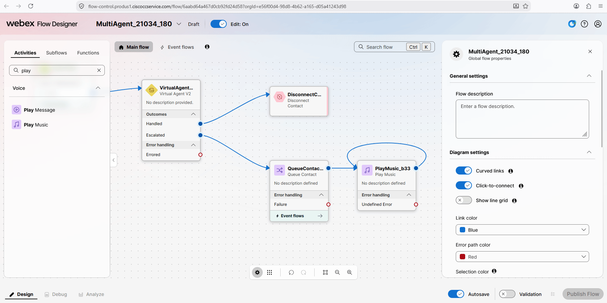
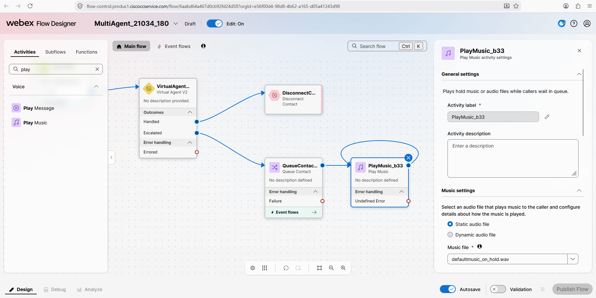

# Mission 2: Integrating the AI Agent with Flow for Voice Calls

## Mission overview

Your mission is to:

Integrate the AI Agent with the Voice Flow.

### Task 1. Build WxCC voice flow with AI Agent.

1. Open [Collaboration Control Hub](https://admin.webex.com){:target="_blank"}, go to **Contact Center**, navigate to **Flows**, click the **Manage Flows** dropdown list, and select **Create Flows**.
   

2. On the next page, select **Start from scratch** and click **Next**.
   

3. In the Voice Flow Designer, from the left side, move the **VirtualAgentV2** node and connect **Start Flow** to the **VirtualAgentV2** node.
   

4. Click **VirtualAgentV2**. In the **Contact Center AI Config**, select **Webex AI Agent (Autonomous)**. Under the **Virtual agent** config, select the AI Agent that you created in the previous mission — **<copy><w class="attendee"></w>_21034_Concierge</copy>**.
   

5. Add a **Disconnect Contact** node and connect the **Handled** output from the **VirtualAgentV2** node to the **Disconnect Contact** node.
   

6. Add a **Queue Contact** node and connect the **Escalate** output from **VirtualAgentV2** to the **Queue Contact** node.
   

7. Click **Queue Contact**. Select Channel type as **Voice**. Select the Queue as **<copy>21034_Queue</copy>**.
   

8. Add a **Play Music** node. Connect the **Queue Contact** node to the **Play Music** node. Loop the **Play Music** node to itself.
   

9. Click the **Play Music** node and select **defaultmusic_on_hold.wav** as the music file.
   

10. Validate and publish the flow with the **Latest** tag.
   

11. Assign the flow to your **Entry Point**. First go to **Entry Point** and search for your channel **<copy><w class="attendee"></w>\_21034_Channel</copy>**.
   

12. Go back to Collaboration Control Hub > Contact Center. Click **Entry Points**. Click **<copy><w class="attendee"></w>\_21034_Channel</copy>**. In the **Entry Point** settings section, change the following and then **Save** the changes. 
    Routing Flow: **<copy>MultiAgent_21034_<w class="attendee"></w></copy>** 
    Version Label: **Latest** 
    

13. Dial the support number assigned to your **<w class="attendee"></w>\_21034_Channel** to test the Concierge AI Agent over a voice call.
   

<strong>Congratulations, you have officially completed this mission! 🎉🎉 </strong>

