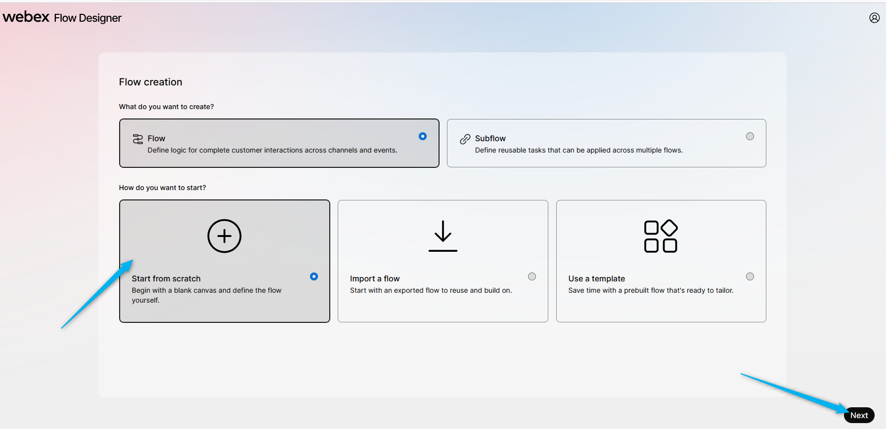
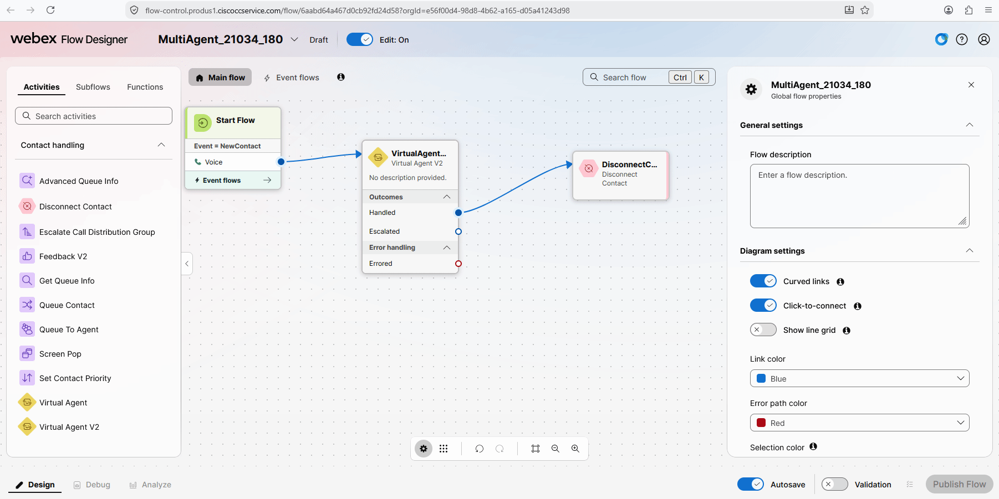
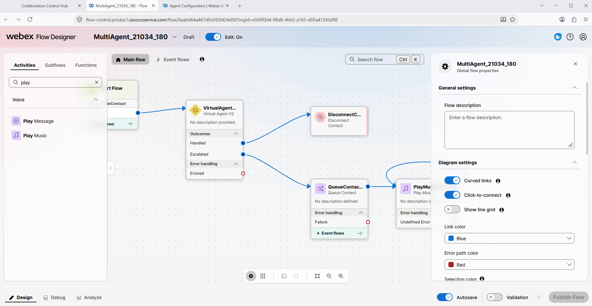
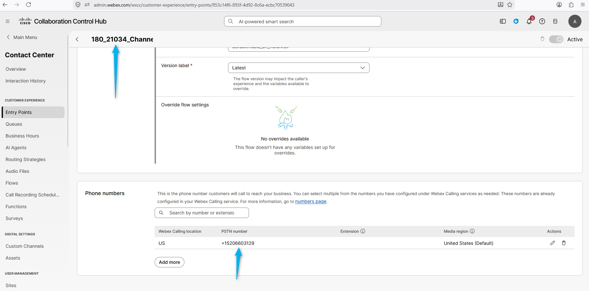

# Mission 2: Integrating the AI Agent with Flow for Voice Calls

## Mission overview

Your mission is to:

Integrate the AI Agent with the Voice Flow.

### Task 1. Build WxCC voice flow with AI Agent.

1. Open [Collaboration Control Hub](https://admin.webex.com){:target="_blank"} and go to **Contact Center** navigate to **Flows**, click on **Manage Flows** dropdown list and select **Create Flows**.
   

2. On the next page select **Start from scratch** and click on **Next**
   

3. Name the flow **<copy>MultiAgent_21034_<w class="attendee"></w></copy>** and click on **Create flow**
   

4. From the left side move **Virtual Agent V2 node and connect the Start Flow to the Virtual Agent V2 node

4. Click on **VirtualAgentV2** node and change the Virtual Agent name to the one that is related to your ID - **<copy><w class="attendee"></w>_21034_Concierge</copy>**.
   

5. Validate and publish the flow. 
   

6. Assign the Flow to your **Entry Point**. Do this by first going to **Entry Point** and search for your channel **<copy><w class="attendee"></w>\_21034_Channel</copy>**.
   

7. Click on **<copy><w class="attendee"></w>\_21034_Channel</copy>**. In the **Entry Point** settings section, change the following and then **Save** the changes. 
    Routing Flow: **<copy>MultiAgent_21034_<w class="attendee"></w></copy>** 
    Version Label: **Latest** 
    
8. Dial the support number assigned to your **<w class="attendee"></w>\_21034_Channel** to test the Autonomous AI Agent over a voice call.
   

<strong>Congratulations, you have officially completed this mission! 🎉🎉 </strong>

