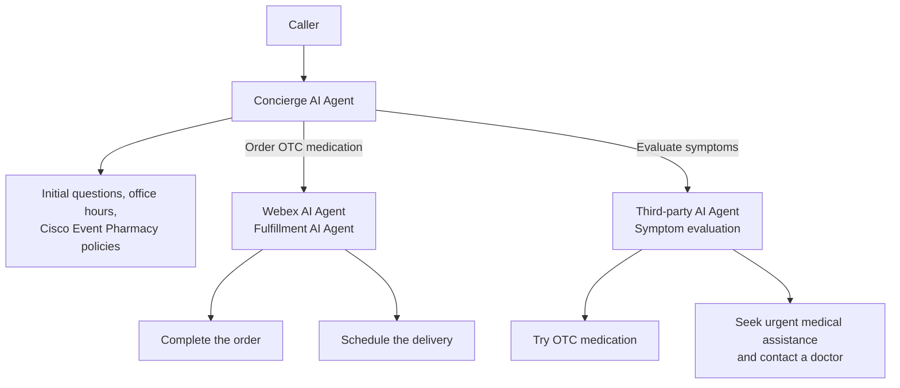

## Configure Multi Agentic Flow Overview

**Configure Multi Agentic Flow** connects the agents in Cisco Event Health so one inbound call can move between specialists.

The **Concierge AI Agent** stays the first point of contact. This section adds the agents that complete an OTC order or evaluate symptoms.

### Call history

1. The call goes to the **Concierge AI Agent**. It answers the initial questions, office hours, Cisco Event Pharmacy policies, and other general questions.
2. If the caller wants to **order OTC medication**, the Concierge transfers the call to another **Webex AI Agent**. That agent completes the order and schedules delivery.
3. If the caller wants to **evaluate symptoms**, the Concierge moves the call to a **third-party AI Agent**. That agent evaluates symptoms to understand whether the caller can try OTC medication, or should seek urgent medical assistance and contact a doctor.

### Agents in this lab

| Agent | Role |
| --- | --- |
| Concierge AI Agent | Answers initial questions, office hours, Cisco Event Pharmacy policies, and other general questions |
| Webex AI Agent | Completes an OTC medication order and schedules delivery |
| Third-party AI Agent | Evaluates symptoms and advises OTC medication or urgent medical assistance |

### In This Lab

Complete **Configure Concierge Webex AI Agent** first. Then configure the specialist transfer:

- **Mission 1: Configure Transfer to OTC Medication Agent**

### Useful References

- [Webex AI Agent Studio Administration Guide](https://help.webex.com/en-us/article/ncs9r37/Webex-AI-Agent-Studio-Administration-guide){:target="_blank"}
- [Guidelines and best practices for automating with AI agent](https://help.webex.com/en-us/article/nelkmxk/Guidelines-and-best-practices-for-automating-with-AI-agent){:target="_blank"}
