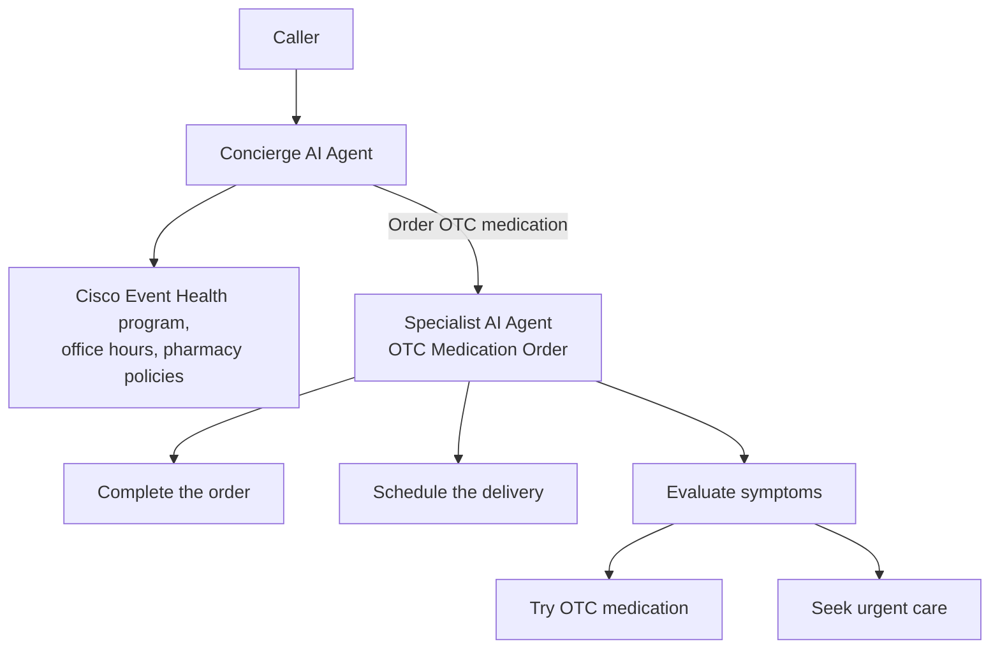

## Configure Multi Agentic Flow Overview

**Configure Multi Agentic Flow** connects the two AI agents in Cisco Event Health so one inbound call can move from the Concierge to the specialist.

The **Concierge AI Agent** stays the first point of contact. This section adds the specialist agent that completes an OTC order and can evaluate symptoms.

### Call history

1. The call goes to the **Concierge AI Agent**. It answers questions about the Cisco Event Health program, office hours, Cisco Event Pharmacy policies, and other general questions.
2. If the caller wants to **order OTC medication**, the Concierge transfers the call to a **specialist AI Agent**. That agent completes the order and schedules delivery.
3. The same specialist agent can also **evaluate symptoms** to understand whether the caller can try OTC medication, or should go to urgent care.

```mermaid
flowchart TD
    Caller[Caller] --> Concierge[Concierge AI Agent]
    Concierge --> FAQ[Cisco Event Health program,<br/>office hours, pharmacy policies]
    Concierge -->|Order OTC medication| Specialist[Specialist AI Agent<br/>OTC Medication Order]
    Specialist --> Complete[Complete the order]
    Specialist --> Delivery[Schedule the delivery]
    Specialist --> Symptoms[Evaluate symptoms]
    Symptoms --> OTC[Try OTC medication]
    Symptoms --> Urgent[Seek urgent care]
```

### Agents in this lab

| Agent | Role |
| --- | --- |
| Concierge AI Agent | Answers questions about the Cisco Event Health program, office hours, Cisco Event Pharmacy policies, and other general questions |
| Specialist AI Agent | Completes an OTC medication order, schedules delivery, and evaluates symptoms (try OTC medication or go to urgent care) |

### In This Lab

Complete **Configure Concierge Webex AI Agent** first. Then configure the specialist transfer:

- **Mission 1: Configure Transfer to OTC Medication Agent**
- **Challenge:** Create a Webex One event AI Agent and transfer callers from the Concierge to that agent
