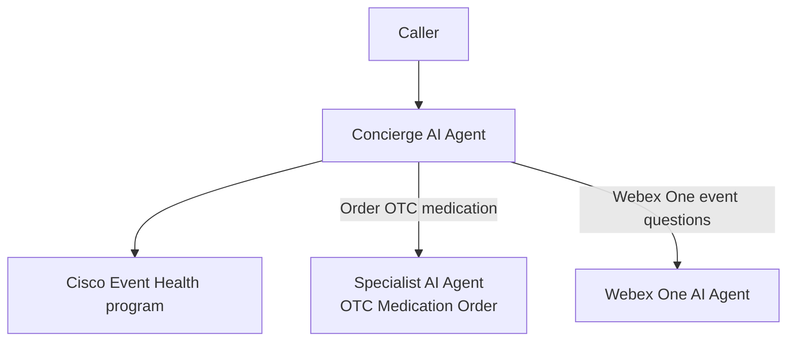
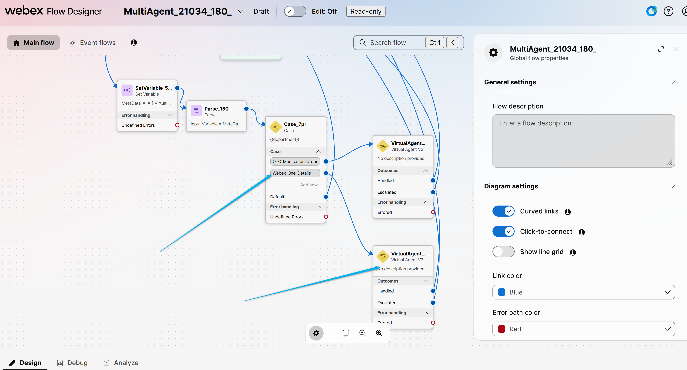

# Challenge

## Challenge overview

Your challenge is to add a third AI Agent that answers questions about the **Webex One** event.

The **Concierge AI Agent** should still answer Cisco Event Health program questions and transfer OTC medication requests to **<copy><w class="attendee"></w>\_21034_OTC_Medication_Order</copy>**. It should also transfer callers who have questions about the Webex One event to your new agent.

This challenge is less guided. Use what you learned in **Configure Concierge Webex AI Agent** and **Mission 1**.



---

## Tasks

### Task 1. Create a new AI Agent for Webex One event questions

Create a new **Autonomous** AI Agent that can answer questions about the Webex One event.

1. In **Webex AI Agent Studio**, create a new agent. Select **Start from Scratch** and type **Autonomous**.
2. Name the agent **<copy><w class="attendee"></w>\_21034_Webex_One</copy>**.
3. Select AI engine **Webex AI Speech-to-Speech 1.0**.
4. Write instructions so this agent answers **Webex One event** questions. Do **not** handle OTC orders or Cisco Event Health pharmacy questions.
5. Add a welcome message for this agent.

### Task 2. Attach the preconfigured knowledge base

1. Open the **Knowledge** tab on your new agent.
2. Search for the preconfigured knowledge base **<copy>Webex_One</copy>** and attach it.
3. **Save changes** and **Publish** the agent.

### Task 3. Add another branch in the voice flow

1. Open your voice flow **<copy>MultiAgent_21034_<w class="attendee"></w></copy>** and click **Edit**.
2. Add one more branch on the **Case** node for the new department. Use LINK Description **<copy>Webex_One</copy>**.
3. Add one more **VirtualAgentV2** node and connect the **Webex_One** case output to it.
4. Configure the new **VirtualAgentV2** node with:

    > Contact Center AI Config: **Webex AI Agent (Autonomous)**<br>
    > Virtual Agent: **<copy><w class="attendee"></w>\_21034_Webex_One</copy>**<br>

5. Connect **Escalated** to **QueueContact** and **Handled** to **DisconnectContact**, the same way you did for the OTC agent.
6. On this **receiving** VirtualAgentV2 node, open **State Event** and under **Event Data** enter:

    ``` json
    {
      "agent_metadata": {
        "dynamic_welcome_message": true
      }
    }
    ```

    Do **not** add this to the Concierge agent's VirtualAgentV2 node.

7. **Validate** and **Publish** the flow.

Use **Mission 1, Task 3** as the pattern for the Case branch and the second VirtualAgentV2 node.

8. It should similar to the flow below.

    

### Task 4. Update the Concierge instructions and transfer action

1. Open your Concierge AI Agent **<copy><w class="attendee"></w>\_21034_Concierge</copy>**.
2. Update the **Transfer_to_different_department** action and the **department** entity so the Concierge can transfer:

    - OTC medication or symptom requests to **<copy>OTC_Medication_Order</copy>**
    - Webex One event questions to **<copy>Webex_One</copy>**

3. Update the Concierge **Instructions** so the agent can:

    - Answer questions about the Cisco Event Health program
    - Transfer callers who want to order OTC medication to the OTC specialist agent
    - Transfer callers who have questions about the **Webex One event** to **<copy><w class="attendee"></w>\_21034_Webex_One</copy>**

4. You can use a **ChatGPT** free account to rewrite the Concierge instructions. Keep the instructions under **5120** characters so they fit in Webex AI Agent Studio.
5. **Save changes** and **Publish** the Concierge agent.


### Task 5. Test your multi-agent flow

1. Place a test call to the number assigned to your Channel **<copy><w class="attendee"></w>\_21034_Channel</copy>**.
2. Ask a question about the **Cisco Event Health** program. The Concierge should answer.
3. Ask a question about the **Webex One event**. Confirm that the call is transferred to **<copy><w class="attendee"></w>\_21034_Webex_One</copy>**.
4. Place another test call and ask to **order OTC medication**. Confirm that the call still transfers to **<copy><w class="attendee"></w>\_21034_OTC_Medication_Order</copy>**.

<p style="text-align:center"><strong>Congratulations, you have officially completed this challenge! 🎉🎉 </strong></p>
