# Mission 1: Configure Transfer Action to the OTC Medication Order Agent

**<details><summary>What is a Transfer Action? <span style="color: orange;"></span></summary>**

Transfer Action is a task that an AI agent performs by understanding user intents and transferring the interaction back to the WxCC flow with custom data for further processing.

## </details>

## Mission overview

Your mission is to:

Configure a Transfer action on the **Concierge AI Agent** so that when the caller wants to order over-the-counter (OTC) medication, the call is transferred to the specialist agent **<copy><w class="attendee"></w>\_21034_OTC_Medication_Order</copy>**.


---

## Build

### Task 1. Create Transfer to flow action in AI Agent Studio portal

1. Go to **Webex AI Agent** Studio portal.

2. Open your Concierge AI agent with name **<copy><w class="attendee"></w>\_21034_Concierge</copy>** and then click on **Actions**.
   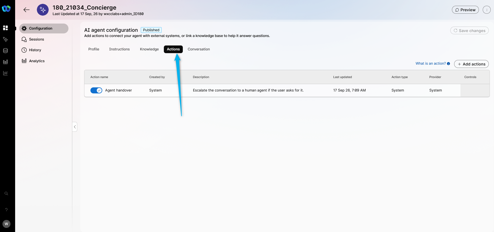

3. Select **Add actions** option and create new **Transfer** action.
   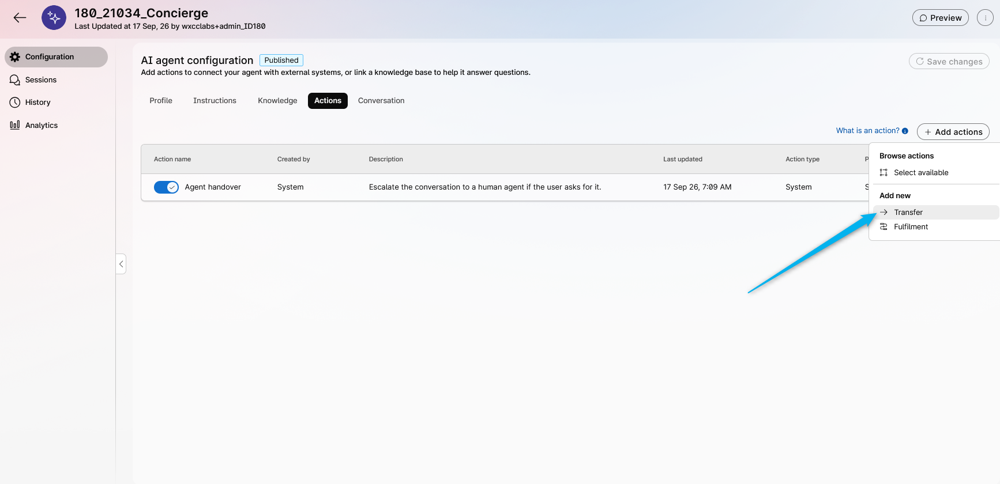

4. Name the action as **<copy>Transfer_to_different_department</copy>**.<br/> In the **Transfer condition** field, paste **<copy>When the customer wants to order OTC medication, transfer the call to the OTC Medication Order specialist agent</copy>**.
   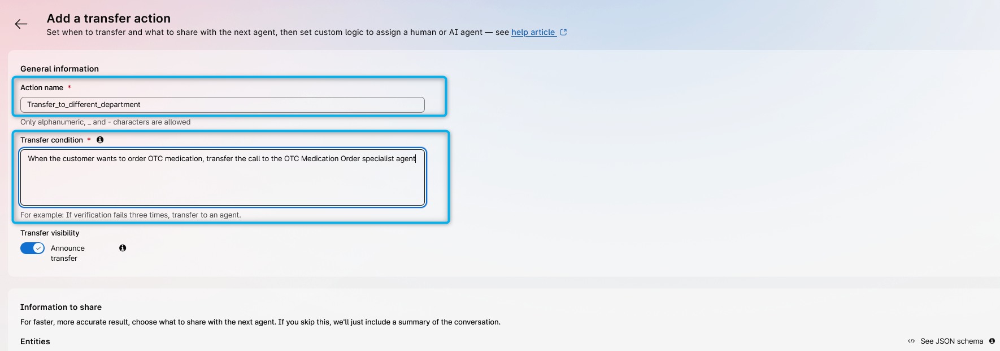

5. Click on add **New input entity**. Configure it with the following: <br>
   > Entity name: **<copy>department</copy>**<br>
   > Entity type: **String**<br>
   > Entity description: **<copy>Collect if the customer wants to order OTC medication. If the caller would like to order medication transfer it to OTC_Medication_Order department.</copy>**<br>
   > Entity example: **<copy>OTC_Medication_Order</copy>**<br>
   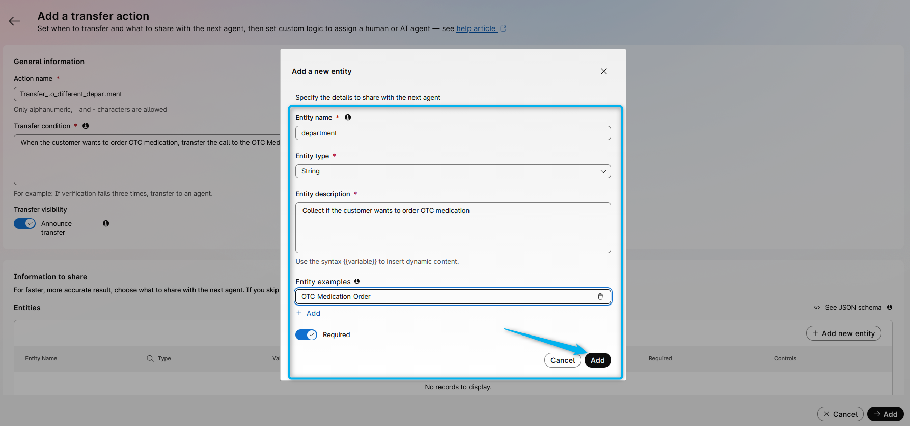

6. Finally, click on **Add** to add the new action.
   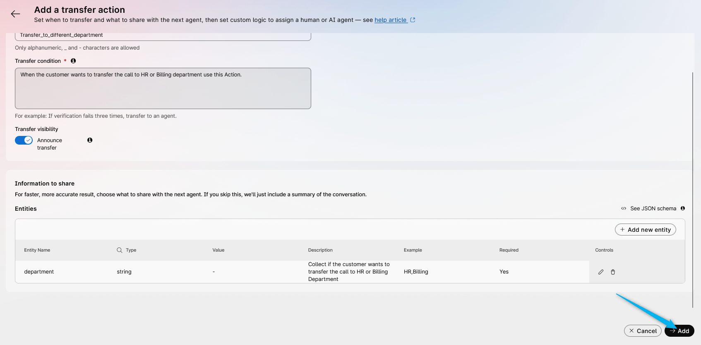

7. **Publish** the AI Agent.
   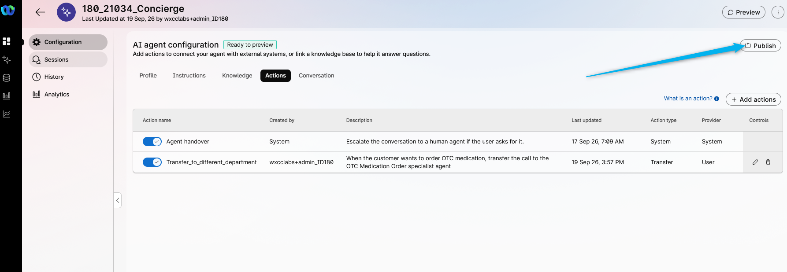

### Task 2. Create a copy of the preconfigured Pharmacy Assistant agent

This copy is the second AI Agent in the multi-agent flow. Callers who want to order OTC medication are transferred from the Concierge to this agent.

1. In **Webex AI Agent Studio**, go to **AI Agents**.

2. Search for the preconfigured Pharmacy Assistant agent **<copy>21034_Pharmacy_Assistant</copy>**.

3. Open the agent menu and select **Copy**.

4. Name the copied agent **<copy><w class="attendee"></w>\_21034_OTC_Medication_Order</copy>** and save the copy.

5. Open **<copy><w class="attendee"></w>\_21034_OTC_Medication_Order</copy>** and confirm it is configured to complete OTC medication orders.

6. **Publish** the copied agent.

### Task 3. Configure voice flow to transfer callers to the OTC Medication Order agent

1. Open your Voice flow **<copy>MultiAgent_21034_<w class="attendee"></w></copy>**. Click on **Edit** to edit the flow.
   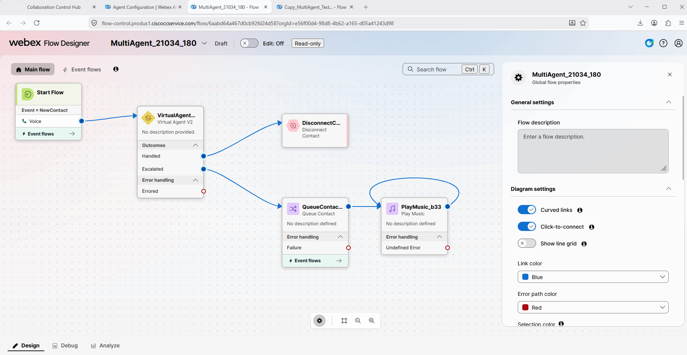

2. (<span style="color: red;"><strong>Read Only</strong></span>) In Task 1, we created an action with the **department** entity. The information about the value of the entity can be retrieved from the Activity Output Variable, specifically from **VirtualAgentV2XXXMetaData**.
   In the next steps, we will add the **Set Variable** block to see the MetaData in JSON format, and then you will add the **Parse** and **Case** nodes to handle the logic and send the call to the specialist destination, in our case we will send it to anohter AI Agent to order the OTC medications.
   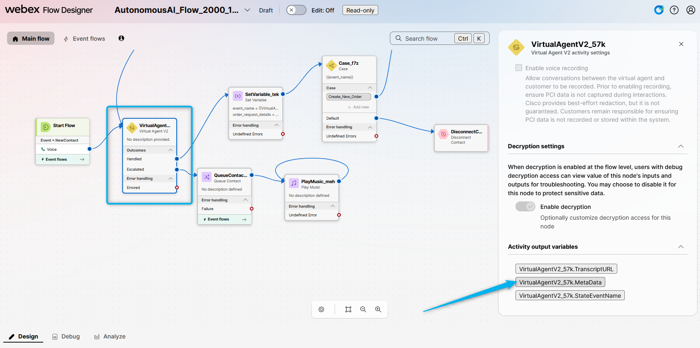

3. Create a new flow variable with name **<copy>MetaData_AI</copy>**. Select type as **string** and then click **Save**.
   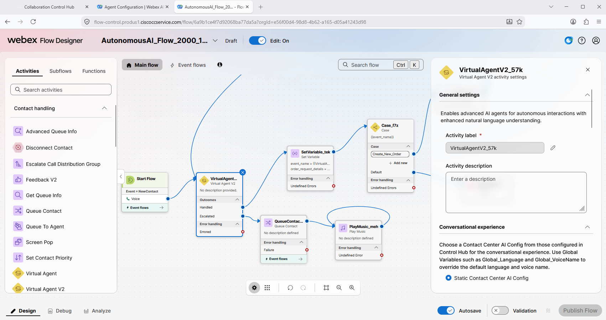

4. Add **Set Variable** node to the flow and connect **Escalated** output of the **VirtualAgentV2** block to the **Set Variable** node.
   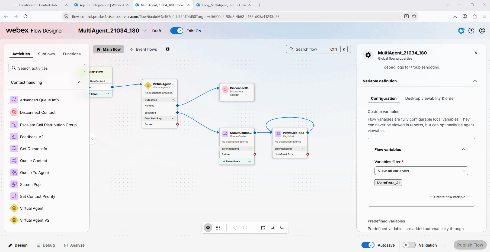

5. Click on **Set Variable** node, select Variable as **MetaData_AI**. For the Variable Value, first click on **VirtualAgentV2** block and copy the name of the MetaData Activity Output Variable. Then post this value inside of the {{ }} to the Variable Value field.
   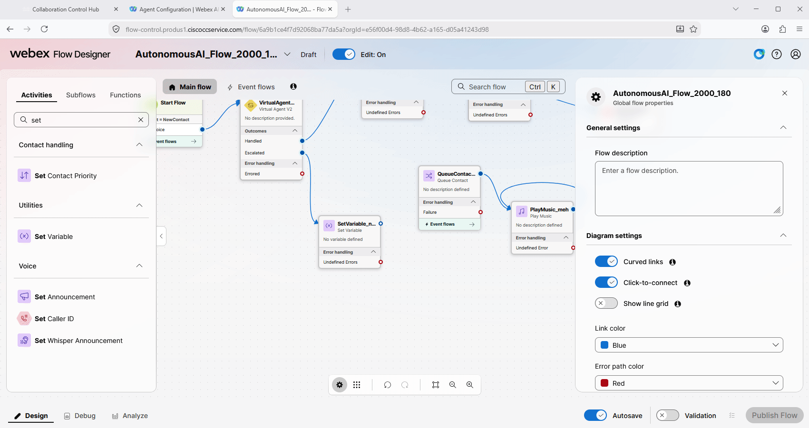

6. Connect **Set Variable** block to the **Queue** node for now. **Validate** and **Publish** the Flow.
   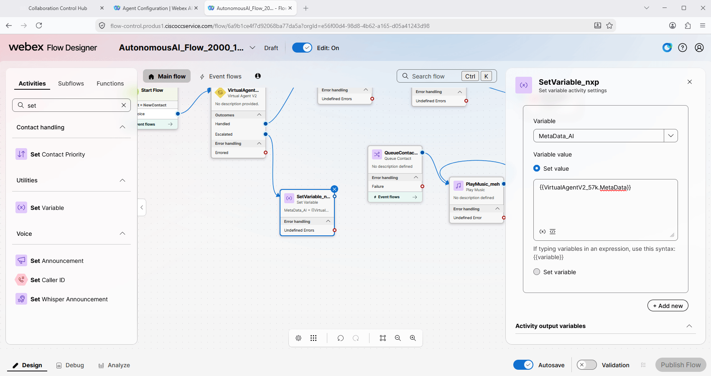

7. Place a test call to the number that is related to your Channel **<copy><w class="attendee"></w>\_21034_Channel</copy>**. During the conversation with the Concierge AI Agent **ask to order OTC medication**. The call should go to the only Queue that is currently configured in the flow.

8. After the call is completed, click on Debug and review the metadata in the Set Variable block.
   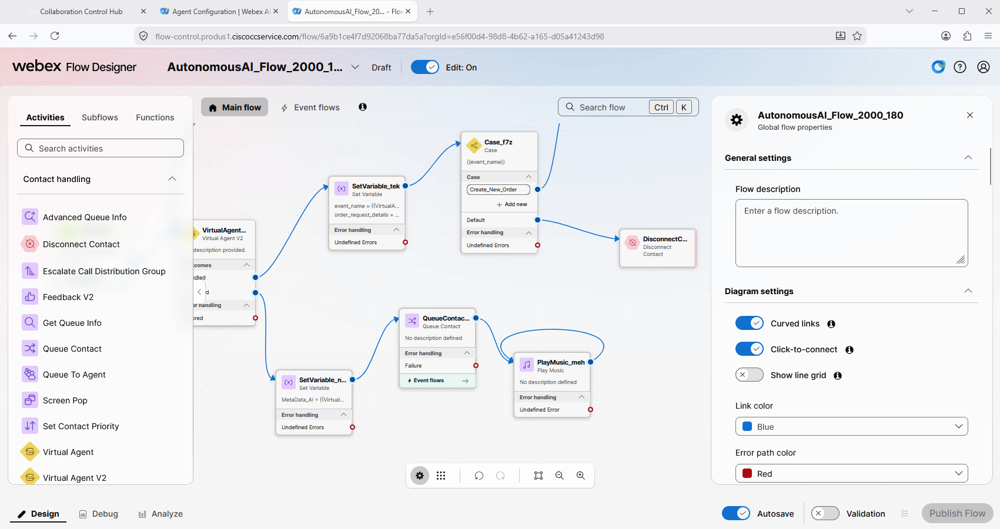

9. (<span style="color: red;"><strong>Read Only</strong></span>) From MetaData we can see the value of the department entity is "OTC_Medication_Order".
    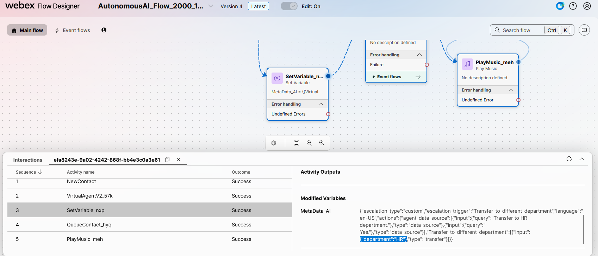

10. (<span style="color: red;"><strong>Read Only</strong></span>) To parse the value in the flow, we need to determine the JSON path to retrieve the value. By using an open-source tool (e.g. [JSONPath Online Evaluator](https://jsonpath.com/){:target="\_blank"}), you can ensure you are using the correct JSON path to extract the value you need. In our case, the JSON path is **$.actions.Transfer_to_different_department[0].input.department** to retrieve the value for the department entity.
    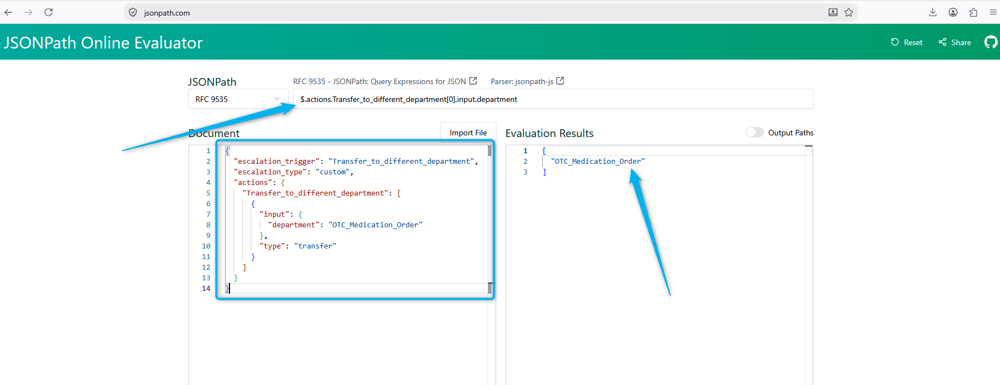

11. Move from the Debug to **Design** field. Create new flow **string** variable with name **<copy>department</copy>**.
    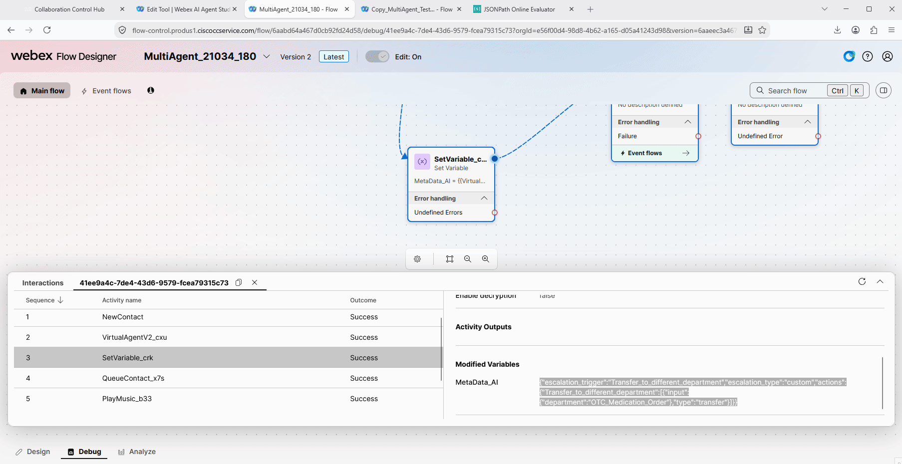

12. Add **Parse** block to the flow and connect **Set Variable** block to the **Parse** block.
    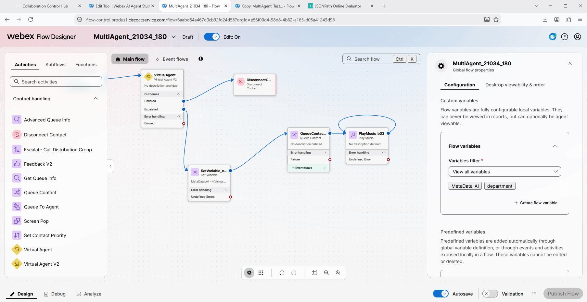

13. Configure the **Parse** block with the following:<br>

    > Input Variable: **<copy>MetaData_AI</copy>**<br>
    > Content Type: **<copy>JSON</copy>**<br>
    > Parse Variable: **<copy>department</copy>**<br>
    > Path Expression: **<copy>$.actions.Transfer_to_different_department[0].input.department</copy>**<br>
    > 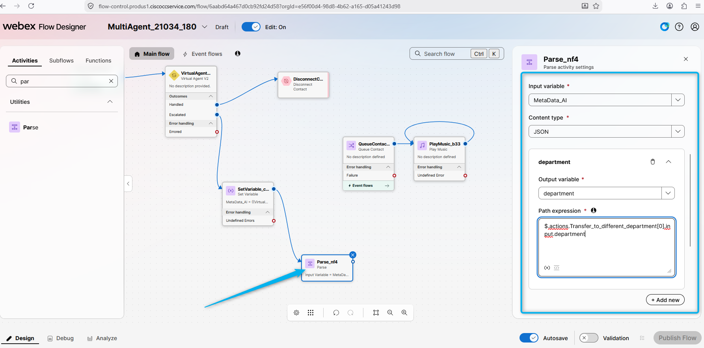

14. Add **Case** node to the flow and connect the **Parse** node to the **Case** node.
    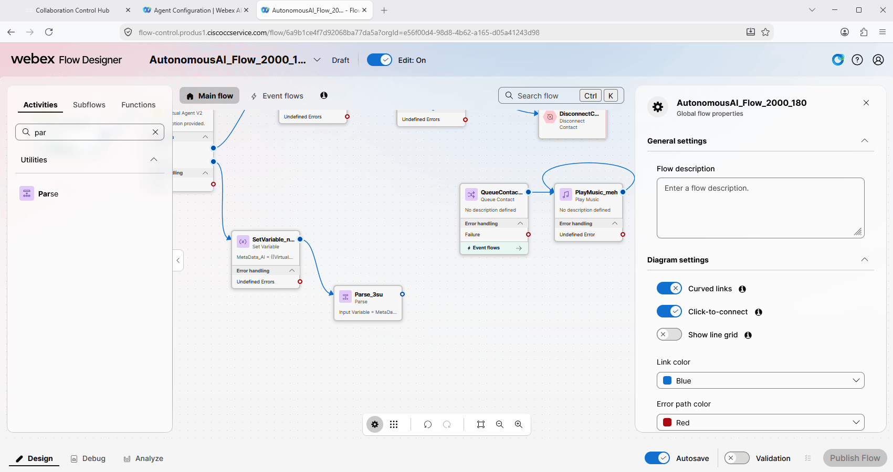

15. Configure the **Case** node with the following:<br>

    > Variable: **<copy>department</copy>**<br>
    > LINK Description: **<copy>OTC_Medication_Order</copy>**<br>
    > 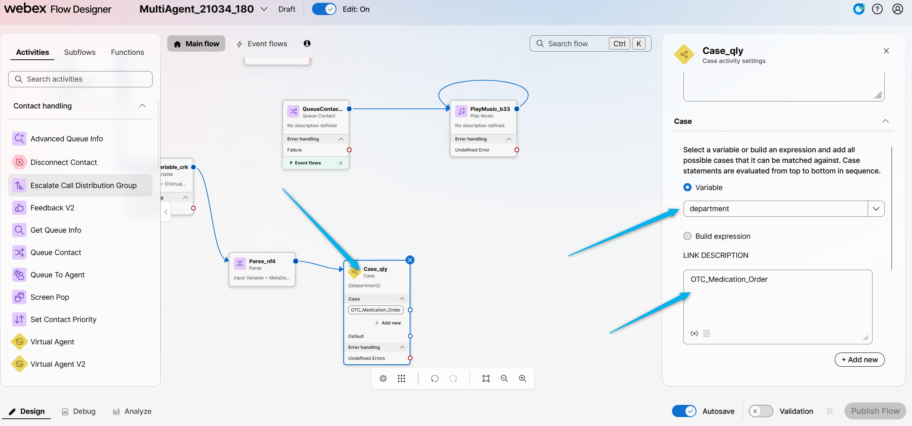

16. Brin one more **VirtualAgentV2** node and connect **OTC_Medication_Order** case node output to the new **VirtualAgentV2** node. 
    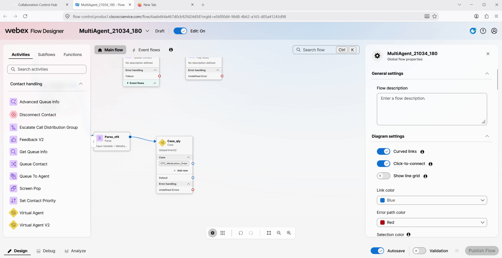

17. Click on this new **VirtualAgentV2** node and select the following:<br>

    > Contact Center AI Config: **Webex AI Agent**<br>
    > Virtual Agent: **<copy>21034_OTC_Medication_Order</copy>**<br>

    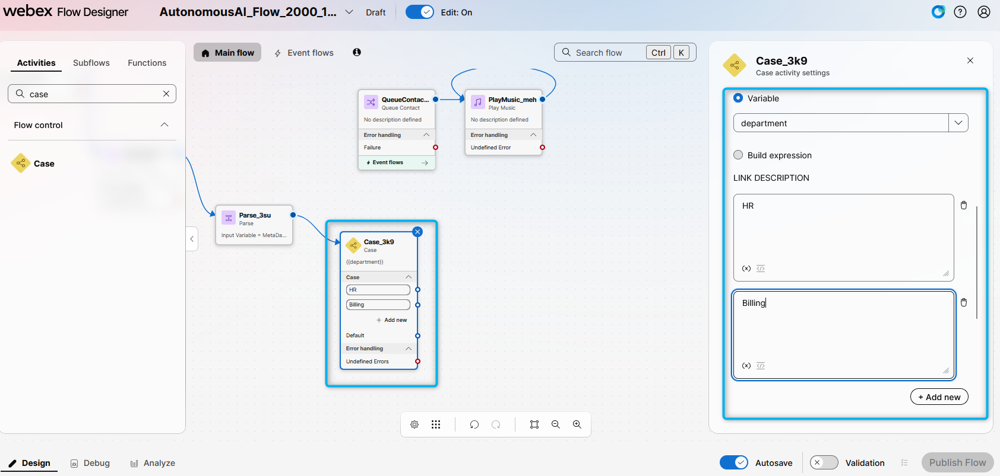

18. Open the **State Event** section and under **Event Data** enter the following (use the **copy** icon on the code block):

    ``` json
    {
      "agent_metadata": {
        "dynamic_welcome_message": true
      }
    }
    ```

    Enable this on the **receiving** agent — the new **VirtualAgentV2** node for **21034_OTC_Medication_Order**. Do **not** add it to the Concierge agent's VirtualAgentV2 node.

    This setting is required for **multi-agent orchestration**. When the Concierge transfers the caller, Webex already shares the conversation history with **21034_OTC_Medication_Order**. With `dynamic_welcome_message` set to `true`, that specialist agent **skips its static welcome prompt**, so the caller does not hear a second greeting. The OTC agent continues the same conversation.

    For more details, see [Multi-agent orchestration](https://help.webex.com/en-us/article/5a07xcb/Multi-agent-orchestration){:target="_blank"}.
    > 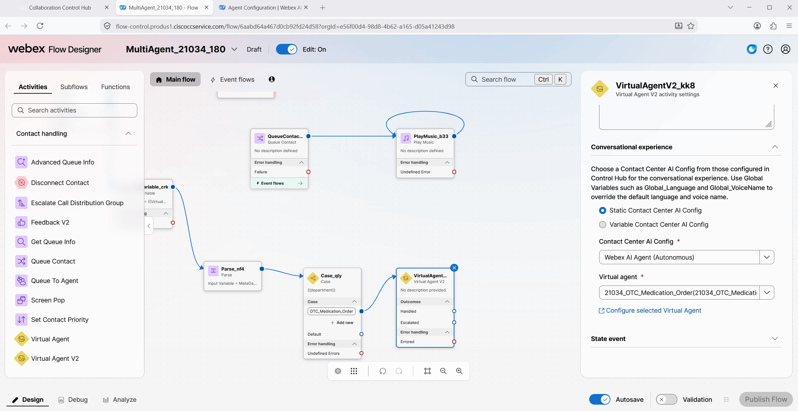

19. Connect Escalated output from the new **VirtualAgentV2** node to the **QueueContact** node.
    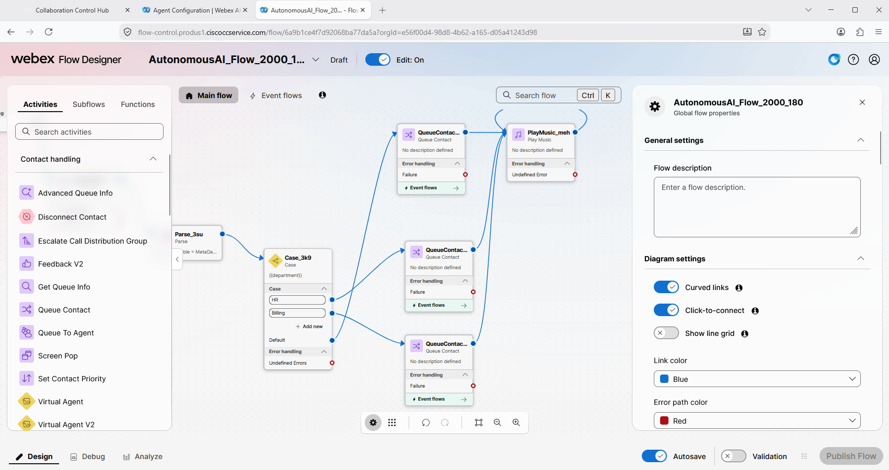

20. Connect Handled output from the new **VirtualAgentV2** node to the **DisconnectContact** node.
    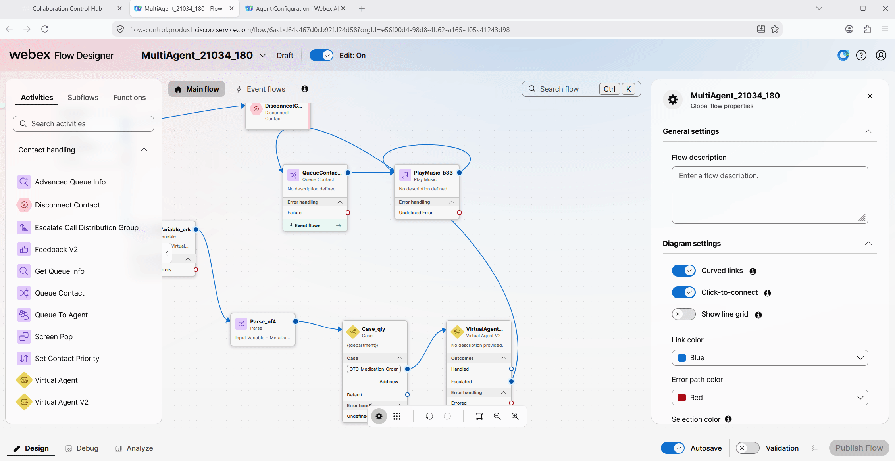

21. Connect Default output from **Case** node to  **QueueContact** node
    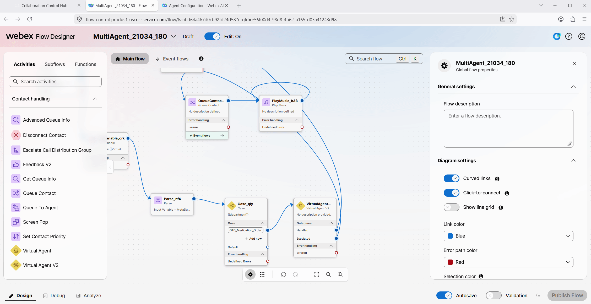

22. **Validate** and **Publish** the flow.
    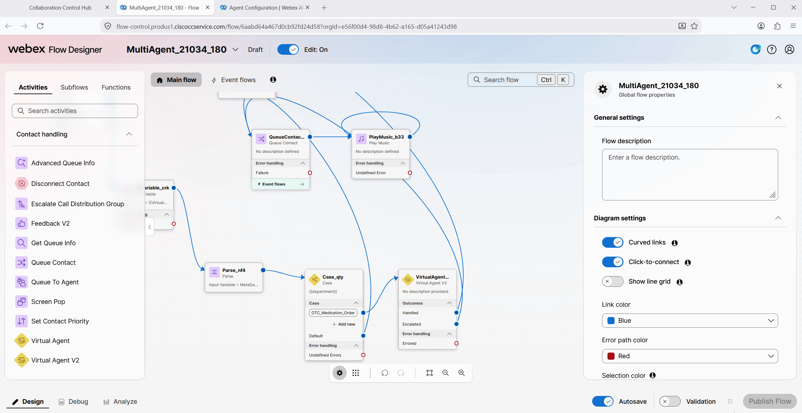

23. Place a test call to the number that is related to your Channel **<copy><w class="attendee"></w>\_21034_Channel</copy>**. During the conversation with the Concierge AI Agent **ask to order OTC medication**. The call should be transferred to the second AI Agent that is already preconfigured to be able to complete OTC order for you. 
    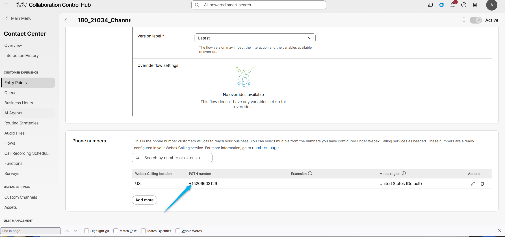

<p style="text-align:center"><strong>Congratulations, you have officially completed this mission! 🎉🎉 </strong></p>
