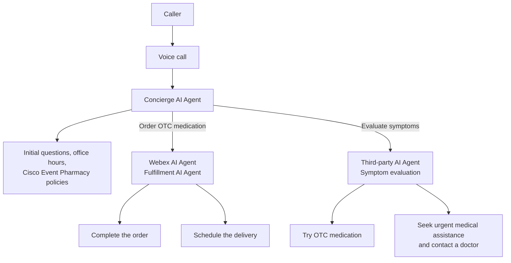

## Get your login credentials

On your screen, look for the file named Credentials_21209_(ID). Open the file; you should see the following information:
   

As the next step, you need to set up your lab for your Attendee ID. In this case, you will all do configuration on the same tenant without interrupting other users.
<!-- Markdown content with embedded HTML -->

    <h3><b>Please submit the Attendee ID below.</b></h3> 
    <h3>All configuration entries in the lab guide will be renamed to include your Attendee ID.</h3>
    <form id="info">
        <label for="attendee">Attendee ID:</label>
        <input type="text" id="attendee" name="attendee" placeholder="Enter 3 digits" required>
        <button onclick="setValues()">Save</button>
    </form>

     

    
Your stored Attendee ID is:<w class="attendee"> No ID stored</w>

## Overview of the Use Case

You are designing **Webex Event Health** — a multi-agent health assistance service for Cisco and Webex event attendees who are traveling and away from their regular healthcare providers.

Attendees call a single number whenever they feel unwell or need healthcare assistance while at an event. The **Concierge AI Agent** answers first. Depending on what the caller needs, the call is transferred to another Webex AI Agent or to a third-party AI Agent.

[Webex AI Agent use case example](https://blog.webex.com/customer-experience/announcing-general-availability-of-webex-ai-agent-paving-way-new-era-cx/){:target="_blank"}

### Business Problem

While traveling to an event, attendees may:

- Feel sick and not know where to get care
- Be far from their family doctor
- Need pharmacy office hours or Cisco Event Pharmacy policies
- Need over-the-counter (OTC) medication delivered to their hotel
- Need help evaluating symptoms before they try OTC medication or seek urgent care

### Call history

1. The call goes to the **Concierge AI Agent**. This agent answers the initial questions: office hours, Cisco Event Pharmacy policies, and other general questions.
2. If the caller wants to **order OTC medication**, the Concierge transfers the call to another **Webex AI Agent**. That agent completes the order and schedules delivery.
3. If the caller wants to **evaluate symptoms**, the Concierge moves the call to a **third-party AI Agent**. That agent evaluates symptoms to determine whether the caller can try OTC medication, or should seek urgent medical assistance and contact a doctor.

## Disclaimer

The lab design and configuration examples provided are for educational purposes. For production design queries, please consult your Cisco representative or an authorized Cisco partner.

Let's get started and discover how a **multi-agent Webex Event Health** service delivers intelligent assistance for event attendees!
