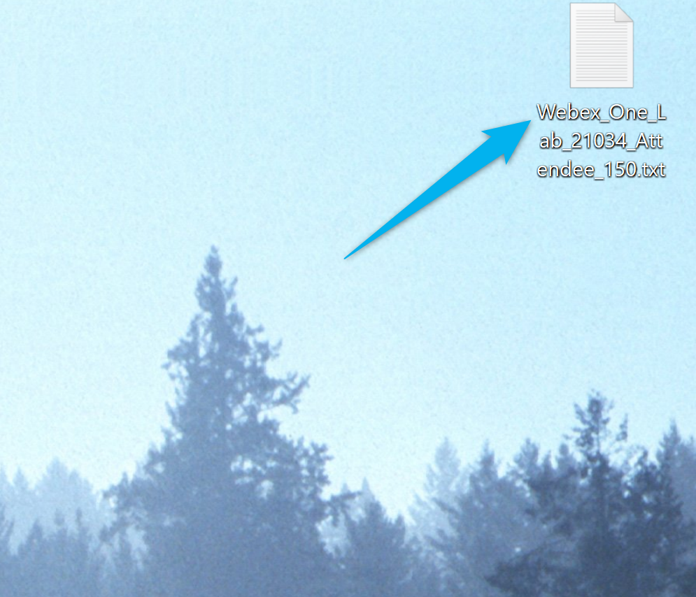
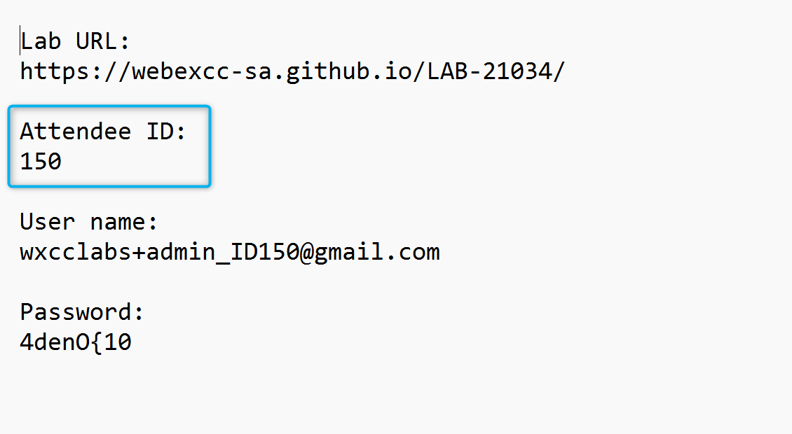
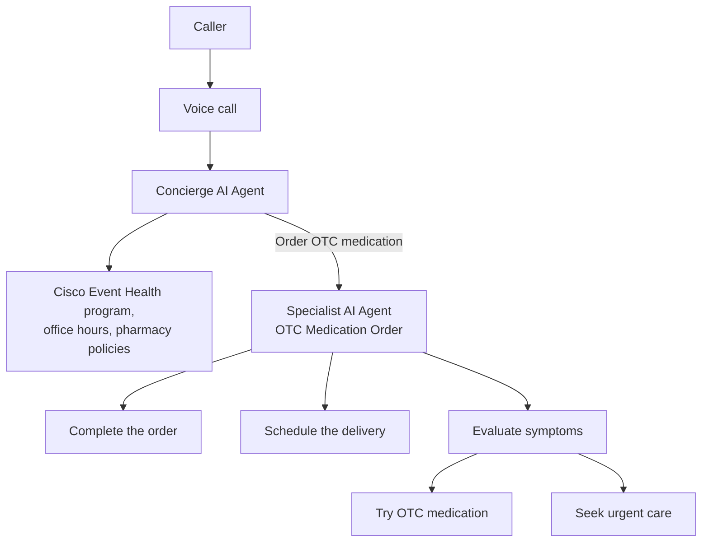

## Get your login credentials

On the top right of the screen you will see the file named **Webex_One_Lab_21034_Attendee_ID**.
   

Open the file. It will have the lab guide, login credentials, and the ID. You need to enter this ID in the next step to prebuild your lab for your ID.
   

As the next step, you need to set up your lab for your Attendee ID. In this case, you will all do configuration on the same tenant without interrupting other users.
<!-- Markdown content with embedded HTML -->

    <h3><b>Please submit the Attendee ID below.</b></h3>
    
All configuration entries in the lab guide will be renamed to include your Attendee ID.

    <form id="info">
        <label for="attendee">Attendee ID:</label>
        <input type="text" id="attendee" name="attendee" placeholder="Enter 3 digits" maxlength="3" required>
        <button type="button" onclick="setValues()">Save</button>
    </form>
    
Your stored Attendee ID is: <w class="attendee">No ID stored</w>

## Overview of the Use Case

You are designing **Cisco Event Health** — a multi-agent health assistance service for Cisco and Webex event attendees who are traveling and away from their regular healthcare providers.

Attendees call a single number whenever they feel unwell or need healthcare assistance while at an event. The **Concierge AI Agent** answers first. If the caller wants to order over-the-counter (OTC) medication, the Concierge transfers the call to a **specialist AI Agent**.

### Business Problem

While traveling to an event, attendees may:

- Feel sick and not know where to get care
- Be far from their family doctor
- Need pharmacy office hours or Cisco Event Pharmacy policies
- Need over-the-counter (OTC) medication delivered to their hotel
- Need help evaluating symptoms before they try OTC medication or seek urgent care

### Event health benefit

As part of this demonstration program:

- The **first $15 of eligible OTC medication purchases is covered** for the attendee.
- **Hotel delivery is free** for eligible orders.
- If an eligible purchase exceeds $15, the attendee is responsible for the remaining amount.

This benefit is offered as a way to thank attendees for joining the event and to make their event experience more convenient and comfortable.

### Call history

1. The call goes to the **Concierge AI Agent**. This agent answers questions about the Cisco Event Health program: office hours, Cisco Event Pharmacy policies, and other general questions.
2. If the caller wants to **order OTC medication**, the Concierge transfers the call to a **specialist AI Agent**. That agent completes the order and schedules delivery.
3. The same specialist agent can also **evaluate symptoms** to determine whether the caller can try OTC medication, or should go to urgent care.

```mermaid
flowchart TD
    Caller[Caller] --> Voice[Voice call]
    Voice --> Concierge[Concierge AI Agent]
    Concierge --> FAQ[Cisco Event Health program,<br/>office hours, pharmacy policies]
    Concierge -->|Order OTC medication| Specialist[Specialist AI Agent<br/>OTC Medication Order]
    Specialist --> Complete[Complete the order]
    Specialist --> Delivery[Schedule the delivery]
    Specialist --> Symptoms[Evaluate symptoms]
    Symptoms --> OTC[Try OTC medication]
    Symptoms --> Urgent[Seek urgent care]
```

## Disclaimer

The lab design and configuration examples provided are for educational purposes. For production design queries, please consult your Cisco representative or an authorized Cisco partner.

Let's get started and discover how a **multi-agent Cisco Event Health** service delivers intelligent assistance for event attendees!
